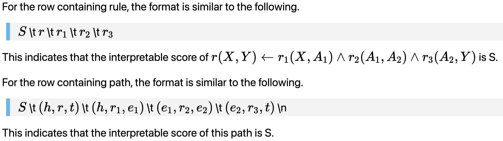

# BIMR

Datasets for EMNLP 2021 paper [Is Multi-Hop Reasoning Really Explainable? Towards Benchmarking Reasoning Interpretability](https://arxiv.org/pdf/2104.06751.pdf) 

## Dataset

Unpack the data files

``` bash
unzip WD15K.zip
```

and there will be four files under the folder `WD15K`.

``` bash
# training set
WD15K/train.txt

# valid set
WD15K/valid.txt

# test set
WD15K/test.txt

# Interpretability score for every rules in our A-benchmark
WD15K/interpretability.txt
```

## Data format

Each section separated by the blank line represents the relevant part of a rule. For each section, the first row is the rule and the corresponding interpretability score, and the remaining rows are the paths and the corresponding interpretability scores. If the section contains only rules without paths, it means that the interpretability score of the rule comes from AnyBURL (ref to Table 2 in our paper).



## Cite 

If you use the code, please cite this paper:

Xin Lv, Yixin Cao, Lei Hou, Juanzi Li, Zhiyuan Liu, Yichi Zhang, Zelin Dai. Is Multi-Hop Reasoning Really Explainable? Towards Benchmarking Reasoning Interpretability. *The Conference on Empirical Methods in Natural Language Processing (EMNLP 2021)*.